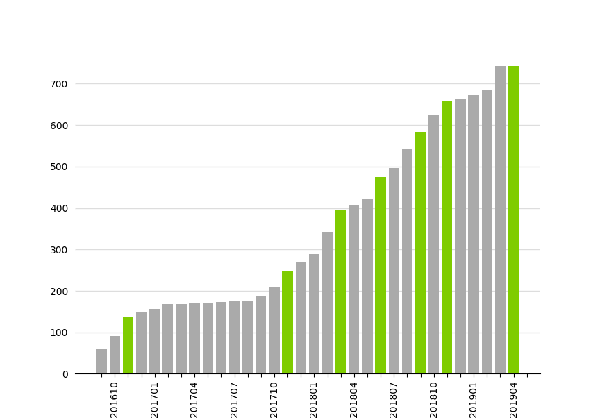

# Meetup Group Growth

This project helps organisers of meetups plot their group's growth in a bar chart. The chart shows a bar per months. Months with a meetup are highlighted in green. The project is based on Python.

## Preparing your file

First, download your member list from meetup.com. For some reason, meetup.com only allows you to download a corrupt .xls file. It isn't really corrupt, it just triggers a warning when you open it. You can easily correct it by opening it in Excel and saving it as an `.xlsx` file. After that, you are good to go.

## Plot your Meetup group growth

You can plot the group of your meetup group by running `main.py`. Make sure to edit the `excel_filepath` and `monts_of_years` in the file before you run it. The `monts_of_years` list should contain the months where you've organised a meetup. Format them in YYYYMM,  e.g. 201904 for April 2019.


```python
plot_meetup_growth_from_excel_file_by_months_of_years(
    excel_filepath='input/Eindhoven-Analytics-and-Optimisation-Meetup_Member_List_on_2019-04-01.xlsx',
    months_of_years=[
        '201611',
        '201711',
        '201803',
        '201806',
        '201809',
        '201811',
        '201904',
    ]
)
```

## Example

I've included an example plot of my own meetup group's growth below:

